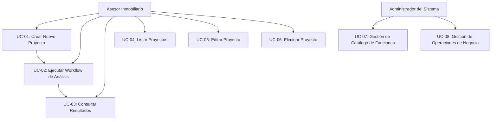

# Casos de Uso

> **Documento:** FASE 1 — Descubrimiento  
> **Fuente principal:** [`VaaIA_ConceptoProyecto.md`](../fuentes-base/01%20VaaIA_ConceptoProyecto.md)  
> **Versión:** 1.0  
> **Fecha:** 2026-03-18

---

## Introducción

Este documento describe los casos de uso principales de VaaIA, enfocándose en las interacciones clave entre el usuario (Asesor Inmobiliario) y el sistema.

---

## Caso de Uso Principal: Crear y Analizar un Proyecto

### UC-01: Crear Nuevo Proyecto desde Anuncio Inmobiliario

| Atributo | Valor |
|-----------|-------|
| **Nombre** | Crear Nuevo Proyecto desde Anuncio Inmobiliario |
| **Actor principal** | Asesor Inmobiliario |
| **Prioridad** | Alta |
| **Frecuencia** | Alta |

#### Descripción

El asesor inmobiliario crea un nuevo proyecto en VaaIA a partir de un anuncio inmobiliario detectado en un portal.

#### Precondiciones

- El asesor está autenticado en el sistema (en fases posteriores)
- El asesor tiene acceso a un anuncio inmobiliario en formato JSON (I-JSON, ver Ejemplo-modelo-info.json)

#### Flujo Principal

1. El asesor selecciona "Nuevo proyecto" en el área "Proyectos" del menú lateral
2. El sistema presenta un formulario para crear el proyecto
3. El asesor pega el contenido I-JSON del anuncio inmobiliario en el campo correspondiente
4. El sistema valida el I-JSON
5. El sistema crea automáticamente el proyecto
6. Los campos del proyecto se rellenan utilizando la información contenida en el I-JSON
7. El I-JSON completo se copia en un campo de tabla del proyecto
8. El I-JSON se guarda en la base de datos D1 de Cloudflare
9. La información del proyecto se presenta al usuario en el formulario de la interfaz (UI)
10. El estado del proyecto se establece como "creado"

#### Postcondiciones

- El proyecto existe en el sistema con un identificador único (ID de la tabla de Proyectos - PYT)
- El I-JSON está almacenado en D1
- El proyecto está listo para ejecutar el workflow de análisis

#### Flujos Alternativos

| Situación | Acción |
|-----------|--------|
| El I-JSON no es válido | El sistema muestra un error y solicita un I-JSON válido |
| El I-JSON está incompleto | El sistema crea el proyecto con los datos disponibles y marca los campos faltantes |

---

### UC-02: Ejecutar Workflow de Análisis

| Atributo | Valor |
|-----------|-------|
| **Nombre** | Ejecutar Workflow de Análisis |
| **Actor principal** | Asesor Inmobiliario |
| **Prioridad** | Alta |
| **Frecuencia** | Alta |

#### Descripción

El asesor inmobiliario ejecuta el workflow de análisis completo sobre un proyecto existente.

#### Precondiciones

- El proyecto existe en el sistema
- El proyecto tiene un I-JSON asociado
- El estado del proyecto es "creado" o "análisis con error"

#### Flujo Principal

1. El asesor accede al formulario del proyecto desde la sección "Proyectos"
2. El asesor hace clic en el botón para ejecutar el workflow de análisis
3. El sistema confirma la ejecución (si el proyecto ya tiene análisis previos)
4. El sistema actualiza el estado del proyecto a "procesando análisis"
5. El sistema lanza un workflow de Cloudflare
6. El workflow ejecuta los pasos en orden secuencial mediante `step.do()`
7. La UI informa al usuario del avance de los pasos del workflow
8. Si todos los pasos se completan sin errores, el estado del proyecto pasa a "análisis finalizado"
9. Si se produce un error, el proceso se detiene, se informa al usuario y el estado pasa a "análisis con error"

#### Pasos del Workflow

| Paso | Descripción | Salida |
|------|-------------|--------|
| 1 | Ejecutar API de OpenAI para generar Resumen | Informe Markdown: Resumen |
| 2 | Ejecutar API de OpenAI para generar Datos clave | Informe Markdown: Datos clave |
| 3 | Análisis físico mediante API de OpenAI | Informe Markdown: Activo físico |
| 4 | Análisis estratégico mediante API de OpenAI | Informe Markdown: Activo estratégico |
| 5 | Análisis financiero mediante API de OpenAI | Informe Markdown: Activo financiero |
| 6 | Análisis regulatorio mediante API de OpenAI | Informe Markdown: Activo regulado |
| 7 | Análisis para inversor mediante API de OpenAI | Informe Markdown: Lectura inversor |
| 8 | Análisis para emprendedor/operador mediante API de OpenAI | Informe Markdown: Lectura emprendedor |
| 9 | Análisis para propietario mediante API de OpenAI | Informe Markdown: Lectura propietario |

#### Postcondiciones

- Todos los informes Markdown se han generado y guardado en R2
- El estado del proyecto se ha actualizado correctamente
- Cada informe Markdown está disponible para visualización en la UI

#### Flujos Alternativos

| Situación | Acción |
|-----------|--------|
| El asesor confirma reejecución | Se borran los archivos Markdown existentes (excepto el JSON) y se vuelven a ejecutar todos los pasos |
| Error en un paso del workflow | El proceso se detiene, se muestra el error tipificado al usuario y el estado pasa a "análisis con error" |
| Reejecución tras error | Se ejecutan todos los pasos sin preguntar al usuario, sustituyendo los resultados anteriores |

---

### UC-03: Consultar Resultados de Análisis

| Atributo | Valor |
|-----------|-------|
| **Nombre** | Consultar Resultados de Análisis |
| **Actor principal** | Asesor Inmobiliario |
| **Prioridad** | Alta |
| **Frecuencia** | Alta |

#### Descripción

El asesor inmobiliario consulta los informes Markdown generados por el workflow de análisis.

#### Precondiciones

- El proyecto existe en el sistema
- El workflow de análisis se ha completado exitosamente
- El estado del proyecto es "análisis finalizado"

#### Flujo Principal

1. El asesor accede al formulario del proyecto desde la sección "Proyectos"
2. La UI muestra un sistema de pestañas (horizontales o verticales)
3. La primera pestaña muestra los datos del proyecto:
   - ID
   - nombre
   - descripción
   - fechas
   - estado
   - asesor responsable
4. El asesor navega entre las pestañas para consultar los diferentes informes
5. Cada pestaña muestra un informe Markdown renderizado
6. El asesor puede revisar manualmente los informes

#### Postcondiciones

- El asesor ha revisado los informes generados
- El asesor dispone de información estructurada para tomar decisiones

---

## Casos de Uso Secundarios

### UC-04: Listar Proyectos

| Atributo | Valor |
|-----------|-------|
| **Nombre** | Listar Proyectos |
| **Actor principal** | Asesor Inmobiliario |
| **Prioridad** | Media |
| **Frecuencia** | Alta |

#### Descripción

El asesor inmobiliario consulta el listado de proyectos existentes en el sistema.

#### Flujo Principal

1. El asesor accede a la sección "Proyectos" del menú lateral
2. El sistema muestra una lista de proyectos con información resumida
3. El asesor puede filtrar u ordenar la lista (opcional en MVP)
4. El asesor puede seleccionar un proyecto para ver el detalle

---

### UC-05: Editar Proyecto

| Atributo | Valor |
|-----------|-------|
| **Nombre** | Editar Proyecto |
| **Actor principal** | Asesor Inmobiliario |
| **Prioridad** | Media |
| **Frecuencia** | Baja |

#### Descripción

El asesor inmobiliario modifica los datos de un proyecto existente.

#### Flujo Principal

1. El asesor accede al detalle del proyecto
2. El asesor hace clic en "Editar"
3. El sistema presenta el formulario con los datos actuales
4. El asesor modifica los campos necesarios
5. El asesor guarda los cambios
6. El sistema actualiza el proyecto en D1

---

### UC-06: Eliminar Proyecto

| Atributo | Valor |
|-----------|-------|
| **Nombre** | Eliminar Proyecto |
| **Actor principal** | Asesor Inmobiliario |
| **Prioridad** | Baja |
| **Frecuencia** | Baja |

#### Descripción

El asesor inmobiliario elimina un proyecto y todos sus datos asociados.

#### Flujo Principal

1. El asesor accede al detalle del proyecto
2. El asesor hace clic en "Eliminar"
3. El sistema solicita confirmación
4. El asesor confirma la eliminación
5. El sistema elimina el proyecto de D1
6. El sistema elimina los archivos asociados en R2

---

## Casos de Uso Técnicos (Fondo)

### UC-07: Gestión de Catálogo de Funciones

| Atributo | Valor |
|-----------|-------|
| **Nombre** | Gestión de Catálogo de Funciones |
| **Actor principal** | Administrador del Sistema |
| **Prioridad** | Baja |
| **Frecuencia** | Baja |

#### Descripción

El administrador gestiona el catálogo de funciones genéricas que el sistema soporta.

#### Funciones del Catálogo

| Función | Descripción |
|---------|-------------|
| F1 | Mostrar formulario |
| F2 | Validar y procesar envío de formulario |
| F3 | Ejecutar llamada a API externa |
| F4 | Ejecutar escritura y consultas en base de datos |
| F5 | Formatear resultados |

---

### UC-08: Gestión de Operaciones de Negocio

| Atributo | Valor |
|-----------|-------|
| **Nombre** | Gestión de Operaciones de Negocio |
| **Actor principal** | Administrador del Sistema |
| **Prioridad** | Baja |
| **Frecuencia** | Baja |

#### Descripción

El administrador gestiona las operaciones de negocio (plantillas de procesos) que los usuarios pueden ejecutar.

---

## Diagrama de Casos de Uso

---

## Restricciones del MVP

Los siguientes casos de uso **NO** están incluidos en el MVP:

- ❌ Ejecución parcial por módulos del workflow
- ❌ Relanzamiento aislado de un único análisis
- ❌ Versionado de prompts
- ❌ Versionado de resultados analíticos
- ❌ Comparadores complejos de escenarios
- ❌ Automatización masiva de captura de múltiples anuncios
- ❌ Producto orientado plenamente a cliente final

---

> **Nota:** Este documento está basado en [`VaaIA_ConceptoProyecto.md`](../fuentes-base/01%20VaaIA_ConceptoProyecto.md) como fuente principal de verdad.
