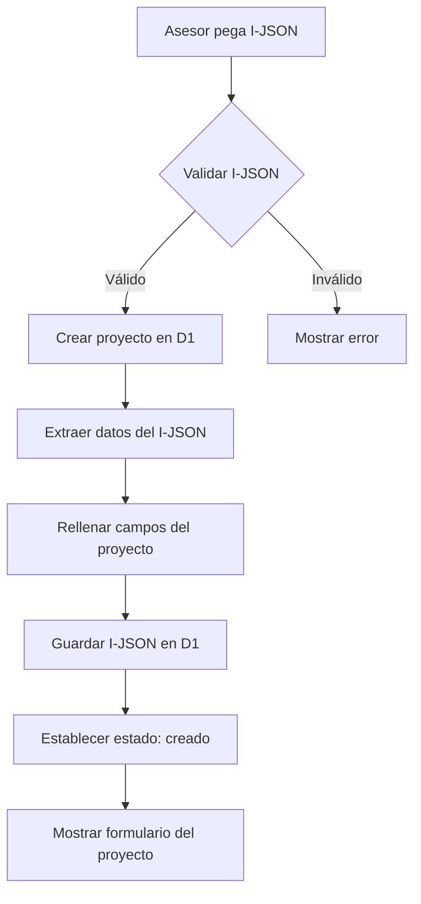
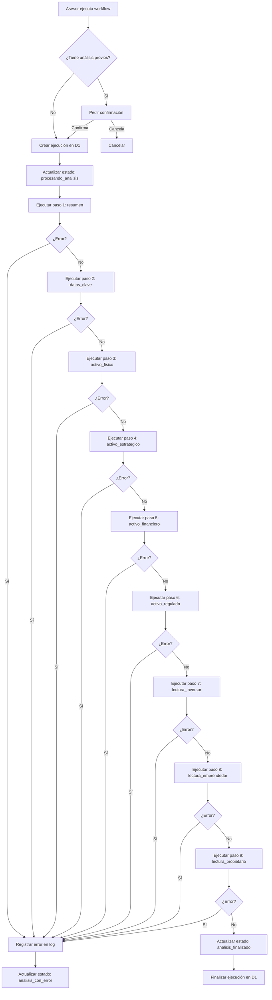
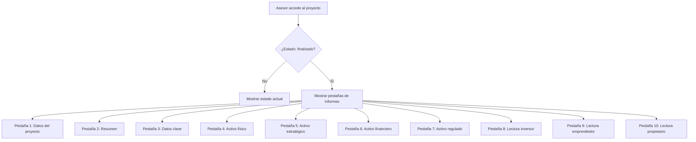

# Especificación: Workflow de Análisis Inmobiliario

> **Documento:** FASE 2 — Definición  
> **Fuente principal:** [`01 vision.md`](../fase01/01%20vision.md)  
> **Versión:** 1.0  
> **Fecha:** 2026-03-18

---

## Resumen

Esta especificación define la funcionalidad principal del MVP de VaaIA: la ejecución de un workflow de análisis inmobiliario que convierte un anuncio en formato JSON (I-JSON) en informes estructurados generados por IA.

---

## Objetivo

Permitir a los asesores inmobiliarios ejecutar un análisis estructurado y completo de un inmueble a partir de un anuncio inmobiliario en formato JSON, generando informes multidimensionales que sirvan como base para decisiones de negocio.

---

## Alcance

### Incluido

- Creación de proyectos a partir de I-JSON
- Ejecución secuencial del workflow de 9 pasos
- Generación de informes Markdown para cada paso
- Almacenamiento de resultados en D1 (datos) y R2 (archivos)
- Gestión de estados del proyecto
- Visualización de resultados en interfaz

### Excluido

- Ejecución parcial por módulos del workflow
- Relanzamiento aislado de un único análisis
- Versionado de prompts o resultados
- Comparadores complejos de escenarios
- Automatización masiva de captura de múltiples anuncios
- Producto orientado plenamente a cliente final

---

## Entidades del Dominio

### Proyecto (PYT)

| Atributo | Tipo | Descripción |
|-----------|-------|-------------|
| `id` | String (UUID) | Identificador único del proyecto |
| `nombre` | String | Nombre del proyecto (extraído del I-JSON) |
| `descripcion` | String | Descripción del proyecto (extraída del I-JSON) |
| `i_json` | JSON | Contenido completo del I-JSON del anuncio |
| `estado` | Enum | Estado del proyecto (ver sección Estados) |
| `asesor_responsable` | String | Identificador del asesor responsable |
| `fecha_creacion` | DateTime | Fecha y hora de creación del proyecto |
| `fecha_actualizacion` | DateTime | Fecha y hora de última actualización |
| `fecha_analisis_inicio` | DateTime | Fecha y hora de inicio del análisis |
| `fecha_analisis_fin` | DateTime | Fecha y hora de finalización del análisis |

### Ejecución de Workflow

| Atributo | Tipo | Descripción |
|-----------|-------|-------------|
| `id` | String (UUID) | Identificador único de la ejecución |
| `proyecto_id` | String (FK) | Referencia al proyecto asociado |
| `estado` | Enum | Estado de la ejecución (ver sección Estados) |
| `fecha_inicio` | DateTime | Fecha y hora de inicio de la ejecución |
| `fecha_fin` | DateTime | Fecha y hora de finalización de la ejecución |
| `error_mensaje` | String | Mensaje de error si la ejecución falló |

### Paso de Workflow

| Atributo | Tipo | Descripción |
|-----------|-------|-------------|
| `id` | String (UUID) | Identificador único del paso |
| `ejecucion_id` | String (FK) | Referencia a la ejecución asociada |
| `tipo_paso` | Enum | Tipo de paso (ver sección Tipos de Paso) |
| `orden` | Integer | Orden secuencial del paso en el workflow |
| `estado` | Enum | Estado del paso (ver sección Estados) |
| `fecha_inicio` | DateTime | Fecha y hora de inicio del paso |
| `fecha_fin` | DateTime | Fecha y hora de finalización del paso |
| `error_mensaje` | String | Mensaje de error si el paso falló |
| `ruta_archivo_r2` | String | Ruta del archivo Markdown generado en R2 |

---

## Estados

### Estados del Proyecto

| Estado | Descripción | Transiciones desde |
|---------|-------------|-------------------|
| `creado` | Proyecto creado, listo para ejecutar análisis | Inicial |
| `procesando_analisis` | Análisis en ejecución | `creado`, `analisis_con_error` |
| `analisis_con_error` | Análisis completado con errores | `procesando_analisis` |
| `analisis_finalizado` | Análisis completado exitosamente | `procesando_analisis` |

### Estados de Ejecución

| Estado | Descripción | Transiciones desde |
|---------|-------------|-------------------|
| `iniciada` | Ejecución iniciada | Inicial |
| `en_ejecucion` | Ejecución en progreso | `iniciada` |
| `finalizada_correctamente` | Ejecución completada sin errores | `en_ejecucion` |
| `finalizada_con_error` | Ejecución completada con errores | `en_ejecucion` |

### Estados de Paso

| Estado | Descripción |
|---------|-------------|
| `pendiente` | Paso pendiente de ejecución |
| `en_ejecucion` | Paso en ejecución |
| `correcto` | Paso completado exitosamente |
| `error` | Paso completado con error |

---

## Tipos de Paso

| Tipo | Descripción | Salida esperada |
|-------|-------------|------------------|
| `resumen` | Generación de resumen del inmueble | Markdown: Resumen |
| `datos_clave` | Generación de datos clave del inmueble | Markdown: Datos clave |
| `activo_fisico` | Análisis físico del inmueble | Markdown: Activo físico |
| `activo_estrategico` | Análisis estratégico del inmueble | Markdown: Activo estratégico |
| `activo_financiero` | Análisis financiero del inmueble | Markdown: Activo financiero |
| `activo_regulado` | Análisis regulatorio del inmueble | Markdown: Activo regulado |
| `lectura_inversor` | Análisis para perfil inversor | Markdown: Lectura inversor |
| `lectura_emprendedor` | Análisis para perfil emprendedor/operador | Markdown: Lectura emprendedor |
| `lectura_propietario` | Análisis para perfil propietario | Markdown: Lectura propietario |

---

## Reglas de Negocio

### RB-01: Ejecución Completa del Workflow

El workflow debe ejecutar **siempre todos los pasos** en orden secuencial. No se permite ejecución parcial por módulos ni relanzamiento de un único análisis.

### RB-02: Validación de I-JSON

Antes de crear un proyecto, el sistema debe validar que el I-JSON:
- Sea un JSON válido sintácticamente
- Contenga los campos mínimos requeridos (ver sección Validaciones)

### RB-03: Confirmación de Reejecución

Si el proyecto ya tiene análisis previos, el sistema debe pedir confirmación al usuario antes de ejecutar el workflow nuevamente.

### RB-04: Sustitución de Resultados en Reejecución

En caso de reejecución del workflow:
- Se deben **borrar todos los archivos Markdown** existentes
- Se debe **conservar el archivo JSON** original
- Se deben **ejecutar todos los pasos** nuevamente

### RB-05: Reejecución Automática tras Error

Si el estado del proyecto es `analisis_con_error`, el sistema debe permitir reejecución sin pedir confirmación al usuario.

### RB-06: Detención ante Error

Si cualquier paso del workflow falla:
- El proceso debe **detenerse inmediatamente**
- No se deben ejecutar los pasos siguientes
- El estado del proyecto debe pasar a `analisis_con_error`
- El error debe mostrarse al usuario de forma tipificada

### RB-07: Almacenamiento en R2

Para cada proyecto, en R2 se debe crear una **carpeta exclusiva** con la siguiente estructura:

```
r2-almacen/dir-api-inmo/{proyecto_id}/
├── {proyecto_id}.json          # I-JSON completo (se conserva entre reejecuciones)
├── resumen.md
├── datos_clave.md
├── activo_fisico.md
├── activo_estrategico.md
├── activo_financiero.md
├── activo_regulado.md
├── lectura_inversor.md
├── lectura_emprendedor.md
├── lectura_propietario.md
└── log.txt                      # Registro de errores si los hay
```

### RB-08: Registro de Errores

Si se produce un error en cualquier paso:
- Se debe registrar el error en `log.txt`
- El registro debe incluir: fecha, paso, mensaje de error, stack trace si aplica

### RB-09: Actualización de Estados

El estado del proyecto debe actualizarse en los siguientes momentos:
- Al crear el proyecto: `creado`
- Al iniciar el workflow: `procesando_analisis`
- Al completar el workflow sin errores: `analisis_finalizado`
- Al producirse un error: `analisis_con_error`

---

## Flujos Principales

### Flujo 1: Crear Proyecto desde I-JSON



### Flujo 2: Ejecutar Workflow de Análisis



### Flujo 3: Consultar Resultados



---

## Validaciones

### Validación de I-JSON

| Campo | Tipo | Obligatorio | Validación |
|-------|-------|-------------|-------------|
| `url_fuente` | String | No | URL válida |
| `portal_inmobiliario` | String | No | No vacío |
| `id_anuncio` | String | No | No vacío |
| `titulo_anuncio` | String | Sí | No vacío |
| `descripcion` | String | Sí | No vacío |
| `tipo_operacion` | String | Sí | Valores: venta, alquiler, traspaso |
| `tipo_inmueble` | String | Sí | Valores: local, piso, nave, etc. |
| `precio` | String | Sí | Número válido |
| `superficie_construida_m2` | String | No | Número válido |
| `ciudad` | String | Sí | València |
| `barrio` | String | No | No vacío |

---

## Inputs y Outputs

### Input: I-JSON

Formato JSON estructurado con la información completa del anuncio inmobiliario. Ver [`Ejemplo-modelo-info.json`](../fase01/Ejemplo-modelo-info.json) para referencia de estructura.

### Output: Informes Markdown

Cada paso del workflow genera un archivo Markdown con el análisis correspondiente:

| Paso | Archivo | Contenido |
|------|----------|------------|
| 1 | `resumen.md` | Resumen del inmueble |
| 2 | `datos_clave.md` | Datos clave del inmueble |
| 3 | `activo_fisico.md` | Análisis físico |
| 4 | `activo_estrategico.md` | Análisis estratégico |
| 5 | `activo_financiero.md` | Análisis financiero |
| 6 | `activo_regulado.md` | Análisis regulatorio |
| 7 | `lectura_inversor.md` | Lectura para inversor |
| 8 | `lectura_emprendedor.md` | Lectura para emprendedor/operador |
| 9 | `lectura_propietario.md` | Lectura para propietario |

---

## Edge Cases

| Caso | Comportamiento esperado |
|-------|----------------------|
| I-JSON mal formado | Mostrar error de validación al usuario |
| I-JSON incompleto | Crear proyecto con datos disponibles y marcar campos faltantes |
| Error en API de OpenAI | Detener workflow, registrar error en log, actualizar estado a `analisis_con_error` |
| Timeout en API de OpenAI | Detener workflow, registrar error en log, actualizar estado a `analisis_con_error` |
| Reejecución con archivos corruptos en R2 | Sobrescribir archivos existentes sin preguntar |
| Usuario cancela ejecución en progreso | Detener workflow, mantener estado actual del proyecto |

---

## Precondiciones y Postcondiciones

### Precondiciones Generales

- El usuario está autenticado en el sistema (en fases posteriores)
- El usuario tiene acceso a un I-JSON válido
- El sistema tiene configuración de OpenAI API (clave en KV)

### Precondiciones por Flujo

| Flujo | Precondiciones |
|--------|----------------|
| Crear proyecto | Usuario tiene I-JSON válido |
| Ejecutar workflow | Proyecto existe, estado es `creado` o `analisis_con_error` |
| Consultar resultados | Proyecto existe, estado es `analisis_finalizado` |

### Postcondiciones Generales

- Los datos están persistidos en D1
- Los archivos están almacenados en R2
- El estado del proyecto refleja la realidad actual

### Postcondiciones por Flujo

| Flujo | Postcondiciones |
|--------|-----------------|
| Crear proyecto | Proyecto existe en D1, estado es `creado` |
| Ejecutar workflow (éxito) | Todos los informes Markdown generados, estado es `analisis_finalizado` |
| Ejecutar workflow (error) | Error registrado en log, estado es `analisis_con_error` |

---

## Supuestos

1. **Alcance geográfico:** El análisis se centra exclusivamente en València ciudad.
2. **Foco tipológico:** El sistema está optimizado para local comercial, reconversión/cambio de uso y pisos como oficinas.
3. **Prompts predefinidos:** Los prompts para OpenAI API están predefinidos y no requieren configuración por el usuario.
4. **Sin versionado:** No hay versionado de prompts ni de resultados. Cada reejecución sobrescribe lo anterior.
5. **Revisión humana:** Los resultados requieren revisión humana antes de tomar decisiones definitivas.
6. **Fuente única de verdad:** El I-JSON es la fuente única de verdad para el análisis. Si el anuncio cambia, se debe crear un nuevo proyecto.

---

## Requisitos Técnicos

### RT-01: Integración con Cloudflare Workers

El workflow debe implementarse como un Cloudflare Workflow que ejecute los pasos secuencialmente mediante `step.do()`.

### RT-02: Integración con OpenAI API

Cada paso debe llamar a OpenAI API con el prompt correspondiente y el I-JSON como contexto.

### RT-03: Almacenamiento en D1

Los datos del proyecto y la trazabilidad de ejecuciones deben persistirse en D1.

### RT-04: Almacenamiento en R2

Los informes Markdown y el I-JSON deben almacenarse en R2 con la estructura de carpetas definida.

### RT-05: Gestión de Estados

El sistema debe gestionar los estados del proyecto, ejecución y pasos según las transiciones definidas.

### RT-06: Manejo de Errores

El sistema debe capturar, registrar y comunicar errores de forma tipificada al usuario.

---

> **Nota:** Esta especificación está basada en [`01 vision.md`](../fase01/01%20vision.md), [`02 problem-statement.md`](../fase01/02%20problem-statement.md), [`03 user-personas.md`](../fase01/03%20user-personas.md) y [`04 use-cases.md`](../fase01/04%20use-cases.md) como fuentes principales.
