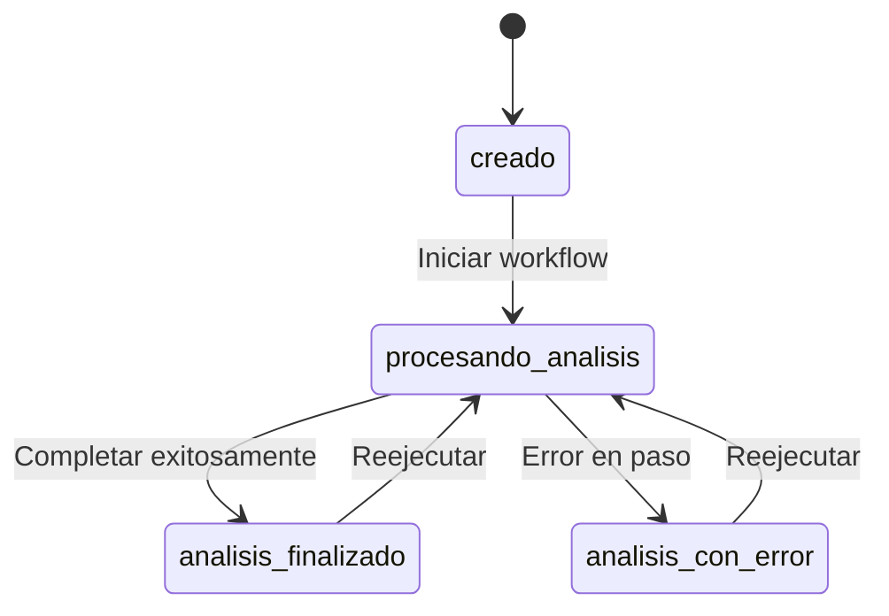
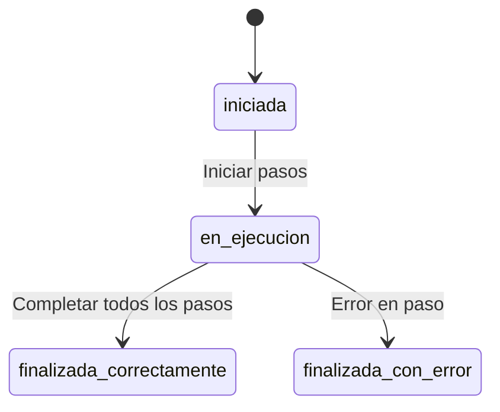
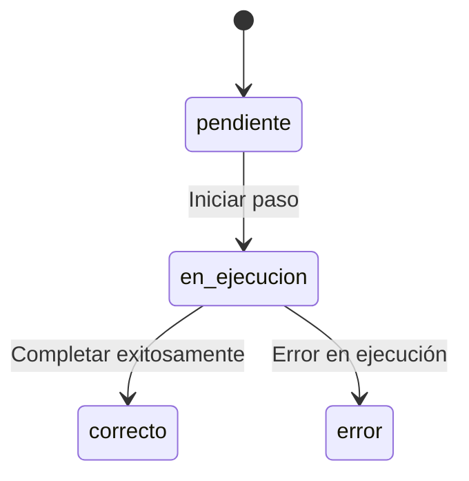
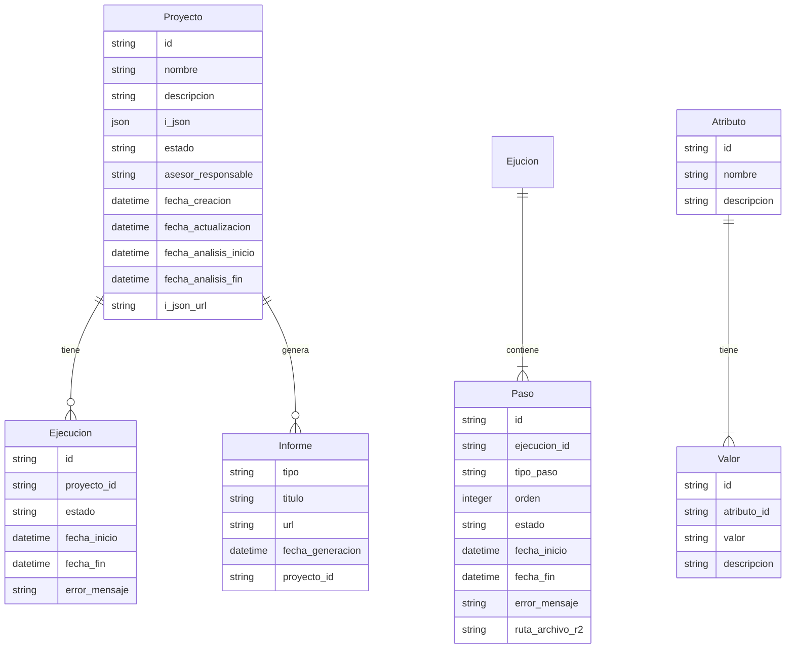

# Modelo de Dominio

> **Documento:** FASE 2 — Definición  
> **Fuente principal:** [`01 vision.md`](../fase01/01%20vision.md)  
> **Versión:** 1.0  
> **Fecha:** 2026-03-18

---

## Resumen

Este documento describe las entidades principales del dominio de VaaIA, sus atributos, relaciones, restricciones y estados relevantes.

---

## Entidades del Dominio

### 1. Proyecto (PYT)

Representa un contenedor de trabajo para el análisis de un inmueble específico.

#### Atributos

| Atributo | Tipo | Obligatorio | Descripción | Restricciones |
|-----------|-------|-------------|-------------|---------------|
| `id` | String (UUID) | Sí | Identificador único del proyecto | Generado por el sistema |
| `nombre` | String | Sí | Nombre del proyecto | Extraído del I-JSON o personalizado |
| `descripcion` | String | No | Descripción del proyecto | Extraída del I-JSON |
| `i_json` | JSON | Sí | Contenido completo del I-JSON del anuncio | Validado antes de persistir |
| `estado` | Enum | Sí | Estado del proyecto | Ver sección Estados |
| `asesor_responsable` | String | No | Identificador del asesor responsable | Email o ID de usuario |
| `fecha_creacion` | DateTime | Sí | Fecha y hora de creación del proyecto | Generado automáticamente |
| `fecha_actualizacion` | DateTime | Sí | Fecha y hora de última actualización | Actualizado en cada modificación |
| `fecha_analisis_inicio` | DateTime | No | Fecha y hora de inicio del análisis | Null hasta que se inicie el workflow |
| `fecha_analisis_fin` | DateTime | No | Fecha y hora de finalización del análisis | Null hasta que se complete el workflow |
| `i_json_url` | String | No | URL del I-JSON almacenado en R2 | Generado al crear el proyecto |

#### Relaciones

| Relación | Tipo | Descripción |
|-----------|-------|-------------|
| `tiene_ejecuciones` | 1:N | Un proyecto puede tener múltiples ejecuciones de workflow |
| `tiene_informes` | 1:N | Un proyecto puede tener múltiples informes Markdown |

#### Restricciones

- `id` es inmutable y generado por el sistema
- `nombre` no puede estar vacío
- `i_json` debe ser un JSON válido
- `estado` solo puede transitar según las reglas definidas

---

### 2. Ejecución de Workflow

Representa una ejecución completa del workflow de análisis sobre un proyecto.

#### Atributos

| Atributo | Tipo | Obligatorio | Descripción | Restricciones |
|-----------|-------|-------------|-------------|---------------|
| `id` | String (UUID) | Sí | Identificador único de la ejecución | Generado por el sistema |
| `proyecto_id` | String (UUID) | Sí | Referencia al proyecto asociado | FK a Proyecto |
| `estado` | Enum | Sí | Estado de la ejecución | Ver sección Estados |
| `fecha_inicio` | DateTime | Sí | Fecha y hora de inicio de la ejecución | Generado automáticamente |
| `fecha_fin` | DateTime | No | Fecha y hora de finalización de la ejecución | Null hasta que se complete |
| `error_mensaje` | String | No | Mensaje de error si la ejecución falló | Null si no hay error |

#### Relaciones

| Relación | Tipo | Descripción |
|-----------|-------|-------------|
| `pertenece_a` | N:1 | Una ejecución pertenece a un proyecto |
| `tiene_pasos` | 1:N | Una ejecución tiene múltiples pasos |

#### Restricciones

- `id` es inmutable y generado por el sistema
- `proyecto_id` debe existir en la tabla de Proyectos
- `estado` solo puede transitar según las reglas definidas
- `fecha_fin` es null hasta que se complete la ejecución

---

### 3. Paso de Workflow

Representa un paso individual dentro de la ejecución del workflow.

#### Atributos

| Atributo | Tipo | Obligatorio | Descripción | Restricciones |
|-----------|-------|-------------|-------------|---------------|
| `id` | String (UUID) | Sí | Identificador único del paso | Generado por el sistema |
| `ejecucion_id` | String (UUID) | Sí | Referencia a la ejecución asociada | FK a Ejecucion |
| `tipo_paso` | Enum | Sí | Tipo de paso | Ver sección Tipos de Paso |
| `orden` | Integer | Sí | Orden secuencial del paso en el workflow | 1-9 |
| `estado` | Enum | Sí | Estado del paso | Ver sección Estados |
| `fecha_inicio` | DateTime | Sí | Fecha y hora de inicio del paso | Generado automáticamente |
| `fecha_fin` | DateTime | No | Fecha y hora de finalización del paso | Null hasta que se complete |
| `error_mensaje` | String | No | Mensaje de error si el paso falló | Null si no hay error |
| `ruta_archivo_r2` | String | No | Ruta del archivo Markdown generado en R2 | Generado al completar el paso |

#### Relaciones

| Relación | Tipo | Descripción |
|-----------|-------|-------------|
| `pertenece_a` | N:1 | Un paso pertenece a una ejecución |

#### Restricciones

- `id` es inmutable y generado por el sistema
- `ejecucion_id` debe existir en la tabla de Ejecuciones
- `orden` es único dentro de una ejecución
- `estado` solo puede transitar según las reglas definidas
- `ruta_archivo_r2` es null hasta que se complete el paso exitosamente

---

### 4. Informe Markdown

Representa un informe generado por un paso del workflow.

#### Atributos

| Atributo | Tipo | Obligatorio | Descripción | Restricciones |
|-----------|-------|-------------|-------------|---------------|
| `tipo` | Enum | Sí | Tipo de informe | Ver sección Tipos de Informe |
| `titulo` | String | Sí | Título del informe | Generado automáticamente |
| `url` | String | Sí | URL del archivo Markdown en R2 | Generado al crear el archivo |
| `fecha_generacion` | DateTime | Sí | Fecha y hora de generación del informe | Generado automáticamente |
| `proyecto_id` | String (UUID) | Sí | Referencia al proyecto asociado | FK a Proyecto |

#### Relaciones

| Relación | Tipo | Descripción |
|-----------|-------|-------------|
| `pertenece_a` | N:1 | Un informe pertenece a un proyecto |

#### Restricciones

- `tipo` es único dentro de un proyecto (no puede haber dos informes del mismo tipo para un proyecto)
- `url` apunta a un archivo existente en R2
- `proyecto_id` debe existir en la tabla de Proyectos

---

### 5. Atributo

Representa un atributo genérico del sistema que puede ser utilizado para gestionar estados u otros valores comunes.

#### Atributos

| Atributo | Tipo | Obligatorio | Descripción | Restricciones |
|-----------|-------|-------------|-------------|---------------|
| `id` | String (UUID) | Sí | Identificador único del atributo | Generado por el sistema |
| `nombre` | String | Sí | Nombre del atributo | Ej: "estado_proyecto" |
| `descripcion` | String | No | Descripción del atributo | Contexto del atributo |

#### Relaciones

| Relación | Tipo | Descripción |
|-----------|-------|-------------|
| `tiene_valores` | 1:N | Un atributo puede tener múltiples valores |

---

### 6. Valor

Representa un valor posible para un atributo.

#### Atributos

| Atributo | Tipo | Obligatorio | Descripción | Restricciones |
|-----------|-------|-------------|-------------|---------------|
| `id` | String (UUID) | Sí | Identificador único del valor | Generado por el sistema |
| `atributo_id` | String (UUID) | Sí | Referencia al atributo asociado | FK a Atributo |
| `valor` | String | Sí | Valor del atributo | Ej: "creado" |
| `descripcion` | String | No | Descripción del valor | Contexto del valor |

#### Relaciones

| Relación | Tipo | Descripción |
|-----------|-------|-------------|
| `pertenece_a` | N:1 | Un valor pertenece a un atributo |

---

## Estados

### Estados del Proyecto

| Estado | Descripción | Transiciones desde |
|---------|-------------|-------------------|
| `creado` | Proyecto creado, listo para ejecutar análisis | Inicial |
| `procesando_analisis` | Análisis en ejecución | `creado`, `analisis_con_error` |
| `analisis_con_error` | Análisis completado con errores | `procesando_analisis` |
| `analisis_finalizado` | Análisis completado exitosamente | `procesando_analisis` |

### Estados de Ejecución

| Estado | Descripción | Transiciones desde |
|---------|-------------|-------------------|
| `iniciada` | Ejecución iniciada | Inicial |
| `en_ejecucion` | Ejecución en progreso | `iniciada` |
| `finalizada_correctamente` | Ejecución completada sin errores | `en_ejecucion` |
| `finalizada_con_error` | Ejecución completada con errores | `en_ejecucion` |

### Estados de Paso

| Estado | Descripción | Transiciones desde |
|---------|-------------|-------------------|
| `pendiente` | Paso pendiente de ejecución | Inicial |
| `en_ejecucion` | Paso en ejecución | `pendiente` |
| `correcto` | Paso completado exitosamente | `en_ejecucion` |
| `error` | Paso completado con error | `en_ejecucion` |

---

## Tipos Enumerados

### Tipo de Paso

| Valor | Descripción | Orden en Workflow |
|-------|-------------|------------------|
| `resumen` | Generación de resumen del inmueble | 1 |
| `datos_clave` | Generación de datos clave del inmueble | 2 |
| `activo_fisico` | Análisis físico del inmueble | 3 |
| `activo_estrategico` | Análisis estratégico del inmueble | 4 |
| `activo_financiero` | Análisis financiero del inmueble | 5 |
| `activo_regulado` | Análisis regulatorio del inmueble | 6 |
| `lectura_inversor` | Análisis para perfil inversor | 7 |
| `lectura_emprendedor` | Análisis para perfil emprendedor/operador | 8 |
| `lectura_propietario` | Análisis para perfil propietario | 9 |

### Tipo de Informe

| Valor | Archivo | Título |
|-------|----------|---------|
| `resumen` | `resumen.md` | Resumen del inmueble |
| `datos_clave` | `datos_clave.md` | Datos clave del inmueble |
| `activo_fisico` | `activo_fisico.md` | Análisis físico |
| `activo_estrategico` | `activo_estrategico.md` | Análisis estratégico |
| `activo_financiero` | `activo_financiero.md` | Análisis financiero |
| `activo_regulado` | `activo_regulado.md` | Análisis regulatorio |
| `lectura_inversor` | `lectura_inversor.md` | Lectura para inversor |
| `lectura_emprendedor` | `lectura_emprendedor.md` | Lectura para emprendedor/operador |
| `lectura_propietario` | `lectura_propietario.md` | Lectura para propietario |

---

## Relaciones entre Entidades

---

## Restricciones de Dominio

### RD-01: Unicidad de Proyecto

No pueden existir dos proyectos con el mismo `id`.

### RD-02: Integridad Referencial

Todo `proyecto_id` en Ejecucion, Paso e Informe debe existir en la tabla de Proyectos.

### RD-03: Integridad Referencial de Ejecución

Todo `ejecucion_id` en Paso debe existir en la tabla de Ejecuciones.

### RD-04: Orden de Pasos

Los pasos de una ejecución deben tener `orden` único y secuencial (1-9).

### RD-05: Unicidad de Informe por Tipo

No pueden existir dos informes del mismo `tipo` para el mismo `proyecto_id`.

### RD-06: Integridad Referencial de Atributos

Todo `atributo_id` en Valor debe existir en la tabla de Atributos.

---

## Valores Iniciales de Atributos

### Atributo: estado_proyecto

| Valor | Descripción |
|-------|-------------|
| `creado` | Proyecto creado, listo para ejecutar análisis |
| `procesando_analisis` | Análisis en ejecución |
| `analisis_con_error` | Análisis completado con errores |
| `analisis_finalizado` | Análisis completado exitosamente |

### Atributo: estado_ejecucion

| Valor | Descripción |
|-------|-------------|
| `iniciada` | Ejecución iniciada |
| `en_ejecucion` | Ejecución en progreso |
| `finalizada_correctamente` | Ejecución completada sin errores |
| `finalizada_con_error` | Ejecución completada con errores |

### Atributo: estado_paso

| Valor | Descripción |
|-------|-------------|
| `pendiente` | Paso pendiente de ejecución |
| `en_ejecucion` | Paso en ejecución |
| `correcto` | Paso completado exitosamente |
| `error` | Paso completado con error |

---

> **Nota:** Este modelo de dominio está basado en [`01 vision.md`](../fase01/01%20vision.md), [`04 use-cases.md`](../fase01/04%20use-cases.md) y [`feature-workflow-analisis.spec.md`](./feature-workflow-analisis.spec.md) como fuentes principales.
