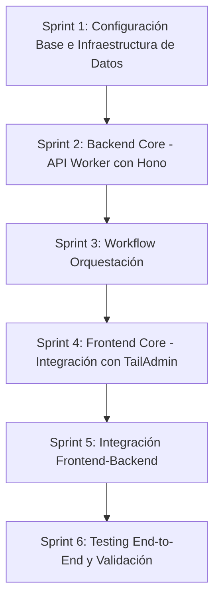

# Plan de Implementación — FASE 4

> **Documento:** FASE 4 — Planificación Técnica (Execution Plan)  
> **Fuentes principales:** [`01 architecture.md`](../fase03/01%20architecture.md), [`03 data-model.md`](../fase03/03%20data-model.md)  
> **Versión:** 1.0  
> **Fecha:** 2026-03-18

---

## Resumen

Este documento define el plan de implementación del MVP de VaaIA, organizando el trabajo en sprints secuenciales y dependientes. El objetivo es traducir el diseño arquitectónico definido en FASE 3 en una implementación funcional desplegada en Cloudflare.

---

## Visión General

El MVP de VaaIA se implementará como una aplicación full-stack en Cloudflare, compuesta por:

- **Frontend:** React 19 + TypeScript + Tailwind CSS v4, basado en TailAdmin
- **Backend:** API Worker con Hono framework
- **Workflow:** Workflow Worker para orquestación de análisis
- **Data:** D1 (SQLite) para persistencia
- **Storage:** R2 para I-JSON e informes Markdown
- **Secrets:** KV para OPENAI_API_KEY

El despliegue se realizará mediante Wrangler desde terminal, integrando con recursos ya existentes.

---

## Estrategia de Implementación

### Principios

1. **Sprints secuenciales y dependientes:** Cada sprint debe completarse y desplegarse antes de iniciar el siguiente.
2. **Integración con recursos existentes:** Aprovechar `secrets-api-inmo`, `r2-almacen` y `cb-consulting`.
3. **Validación continua:** Cada componente debe probarse antes de avanzar.
4. **Documentación de cambios:** Actualizar inventario de recursos al crear/modificar componentes.

### Orden de Prioridades

1. **Configuración base:** package.json, wrangler.toml, schema.sql
2. **Infraestructura de datos:** Creación de D1 database
3. **Backend core:** API Worker con Hono
4. **Workflow orquestación:** Workflow Worker
5. **Frontend core:** Integración con TailAdmin
6. **Integración frontend-backend:** Conexión API
7. **Testing end-to-end:** Validación completa del flujo

---

## Sprints

### Sprint 1: Configuración Base e Infraestructura de Datos

**Objetivo:** Establecer la configuración base del proyecto y crear la infraestructura de datos necesaria.

**Tareas:**

1. Crear `package.json` con dependencias base:
   - Hono para API Worker
   - React 19 + TypeScript para frontend
   - Wrangler para despliegue
   - TypeScript como lenguaje base

2. Crear `wrangler.toml` con bindings:
   - Binding para KV `secrets-api-inmo` (OPENAI_API_KEY)
   - Binding para R2 `r2-almacen`
   - Binding para D1 database (por crear)
   - Environments: dev, production

3. Crear `schema.sql` con migraciones iniciales:
   - Tabla `ani_proyectos`
   - Tabla `ani_ejecuciones`
   - Tabla `ani_pasos`
   - Tabla `ani_atributos`
   - Tabla `ani_valores`
   - Índices para optimización de consultas

4. Crear D1 database:
   - Ejecutar migraciones de schema.sql
   - Verificar que todas las tablas se crearon correctamente
   - Actualizar inventario de recursos con ID de D1

5. Crear estructura de directorios:
   - `src/` para código fuente
   - `workers/` para Cloudflare Workers
   - `frontend/` para React app
   - `migrations/` para scripts de D1

**Dependencias:** Ninguna (primer sprint)

**Criterios de Completación:**
- ✅ package.json creado con todas las dependencias
- ✅ wrangler.toml creado con bindings configurados
- ✅ schema.sql creado con todas las migraciones
- ✅ D1 database creada y accesible
- ✅ Estructura de directorios establecida
- ✅ Inventario de recursos actualizado

---

### Sprint 2: Backend Core — API Worker con Hono

**Objetivo:** Implementar el API Worker con Hono framework, exponiendo los endpoints REST para gestión de proyectos.

**Tareas:**

1. Configurar proyecto Hono:
   - Inicializar aplicación Hono
   - Configurar middleware base (CORS, logging)
   - Configurar routing
   - Integrar bindings de wrangler (D1, R2, KV)

2. Implementar handlers de proyectos:
   - GET /api/v1/proyectos - Listar proyectos
   - POST /api/v1/proyectos - Crear proyecto
   - GET /api/v1/proyectos/{proyecto_id} - Obtener proyecto
   - PUT /api/v1/proyectos/{proyecto_id} - Actualizar proyecto
   - DELETE /api/v1/proyectos/{proyecto_id} - Eliminar proyecto

3. Implementar handlers de workflows:
   - POST /api/v1/proyectos/{proyecto_id}/workflows/ejecutar - Ejecutar workflow
   - GET /api/v1/proyectos/{proyecto_id}/workflows/ejecuciones - Listar ejecuciones
   - GET /api/v1/proyectos/{proyecto_id}/workflows/ejecuciones/{ejecucion_id} - Obtener ejecución

4. Implementar handlers de resultados:
   - GET /api/v1/proyectos/{proyecto_id}/resultados - Obtener resultados
   - GET /api/v1/proyectos/{proyecto_id}/resultados/{tipo_informe} - Obtener informe específico

5. Implementar servicios:
   - Servicio de validación de I-JSON
   - Servicio de gestión de proyectos en D1
   - Servicio de almacenamiento en R2
   - Servicio de recuperación de secrets desde KV

6. Implementar manejo de errores:
   - Validación de errores de I-JSON
   - Manejo de errores de D1
   - Manejo de errores de R2
   - Respuestas con formato `{ error: "..." }`

7. Implementar logging:
   - Logging estructurado para debugging
   - Logs en contexto de Cloudflare Workers

**Dependencias:** Sprint 1 completado

**Criterios de Completación:**
- ✅ API Worker inicializada con Hono
- ✅ Todos los endpoints implementados
- ✅ Servicios creados y probados
- ✅ Validación de I-JSON implementada
- ✅ Manejo de errores implementado
- ✅ Logging configurado
- ✅ Worker puede desplegarse localmente

---

### Sprint 3: Workflow Orquestation

**Objetivo:** Implementar el Workflow Worker que orquesta la ejecución secuencial de 9 pasos de análisis.

**Tareas:**

1. Configurar proyecto Cloudflare Workflows:
   - Definir clase de workflow
   - Configurar bindings (D1, R2, KV)
   - Definir pasos secuenciales (1-9)

2. Implementar lógica de orquestación:
   - Crear ejecución en D1
   - Crear 9 pasos en estado 'pendiente'
   - Ejecutar pasos secuencialmente
   - Manejar transiciones de estado
   - Detener workflow ante error

3. Implementar integración con OpenAI:
   - Recuperar OPENAI_API_KEY desde KV
   - Construir prompts específicos para cada tipo de paso
   - Llamar a OpenAI API con I-JSON como contexto
   - Manejar rate limiting y timeouts
   - Implementar reintentos con backoff exponencial

4. Implementar almacenamiento de resultados:
   - Generar informes Markdown desde respuestas de OpenAI
   - Almacenar informes en R2
   - Almacenar logs de errores en R2
   - Actualizar rutas en pasos de D1

5. Implementar manejo de errores:
   - Capturar errores de OpenAI API
   - Actualizar estado de paso a 'error'
   - Actualizar estado de ejecución a 'finalizada_con_error'
   - Actualizar estado de proyecto a 'analisis_con_error'
   - Generar logs detallados

**Dependencias:** Sprint 1 completado

**Criterios de Completación:**
- ✅ Workflow Worker configurado
- ✅ Lógica de orquestación implementada
- ✅ Integración con OpenAI funcionando
- ✅ Almacenamiento en R2 implementado
- ✅ Manejo de errores implementado
- ✅ Workflow puede desplegarse localmente

---

### Sprint 4: Frontend Core — Integración con TailAdmin

**Objetivo:** Integrar la plantilla TailAdmin y crear la interfaz de usuario para gestión de proyectos.

**Tareas:**

1. Configurar proyecto React:
   - Inicializar proyecto con Vite
   - Configurar TypeScript
   - Configurar Tailwind CSS v4
   - Instalar dependencias base

2. Integrar TailAdmin:
   - Clonar/adaptar plantilla TailAdmin
   - Configurar estructura de rutas
   - Adaptar componentes de layout
   - Configurar navegación

3. Implementar páginas de proyectos:
   - Página de listado de proyectos
   - Página de creación de proyecto (pegar I-JSON)
   - Página de detalles de proyecto
   - Página de resultados en pestañas

4. Implementar componentes de UI:
   - Tablas de proyectos
   - Formularios de creación/edición
   - Visualizadores de informes Markdown
   - Indicadores de estado
   - Manejadores de errores

5. Implementar integración con API:
   - Cliente HTTP para llamadas a API Worker
   - Manejo de estados de carga
   - Validación de I-JSON en frontend
   - Manejo de respuestas `{ data: ... }` y `{ error: "..." }`

6. Implementar políticas de cero hardcoding:
   - Centralización de textos de UI
   - Mensajes de error desde configuración
   - Sin strings inline en componentes

**Dependencias:** Sprint 2 completado

**Criterios de Completación:**
- ✅ Proyecto React inicializado
- ✅ TailAdmin integrado
- ✅ Páginas de proyectos implementadas
- ✅ Componentes de UI creados
- ✅ Integración con API funcionando
- ✅ Políticas de cero hardcoding aplicadas
- ✅ Frontend puede construirse localmente

---

### Sprint 5: Integración Frontend-Backend

**Objetivo:** Conectar el frontend con el backend, validando el flujo completo de creación de proyecto y ejecución de workflow.

**Tareas:**

1. Implementar flujo completo de creación de proyecto:
   - Validación de I-JSON en frontend
   - POST a API para crear proyecto
   - Almacenamiento de I-JSON en R2
   - Actualizar estado en frontend

2. Implementar flujo de ejecución de workflow:
   - POST a API para ejecutar workflow
   - Polling para verificar estado de ejecución
   - Actualización de estados en tiempo real
   - Manejo de confirmación de reejecución

3. Implementar visualización de resultados:
   - GET a API para obtener resultados
   - Renderizado de informes Markdown
   - Navegación entre pestañas de informes
   - Descarga de informes

4. Implementar gestión de errores:
   - Visualización de errores de API
   - Visualización de errores de workflow
   - Mensajes de error amigables
   - Recuperación de estado

5. Implementar optimizaciones:
   - Caché de respuestas frecuentes
   - Lazy loading de informes
   - Paginación en listados

**Dependencias:** Sprint 3 completado

**Criterios de Completación:**
- ✅ Flujo de creación de proyecto funcional
- ✅ Flujo de ejecución de workflow funcional
- ✅ Visualización de resultados implementada
- ✅ Gestión de errores implementada
- ✅ Optimizaciones aplicadas
- ✅ Aplicación completa funciona end-to-end

---

### Sprint 6: Testing End-to-End y Validación

**Objetivo:** Validar completamente el MVP, asegurando que todos los flujos funcionan correctamente.

**Tareas:**

1. Testing de API Worker:
   - Pruebas unitarias de handlers
   - Pruebas de integración con D1
   - Pruebas de integración con R2
   - Pruebas de integración con KV
   - Validación de respuestas

2. Testing de Workflow Worker:
   - Pruebas de orquestación de pasos
   - Pruebas de integración con OpenAI
   - Validación de manejo de errores
   - Pruebas de almacenamiento en R2

3. Testing de Frontend:
   - Pruebas unitarias de componentes
   - Pruebas de integración con API
   - Pruebas de flujos completos
   - Validación de políticas de cero hardcoding

4. Testing end-to-end:
   - Flujo completo: crear proyecto → ejecutar workflow → ver resultados
   - Validación de I-JSON de ejemplo
   - Validación de manejo de errores
   - Validación de reejecución

5. Validación de despliegue:
   - Despliegue local de todos los workers
   - Verificación de bindings en Cloudflare
   - Verificación de D1 database accesible
   - Verificación de R2 bucket accesible
   - Verificación de KV namespace accesible

6. Validación de integración con recursos existentes:
   - Conexión a KV `secrets-api-inmo` funcionando
   - Conexión a R2 `r2-almacen` funcionando
   - OPENAI_API_KEY accesible

**Dependencias:** Sprint 5 completado

**Criterios de Completación:**
- ✅ Todas las pruebas unitarias pasan
- ✅ Todas las pruebas de integración pasan
- ✅ Todos los flujos end-to-end funcionan
- ✅ Despliegue local validado
- ✅ Integración con recursos existentes verificada
- ✅ MVP listo para despliegue en producción

---

## Consideraciones de Despliegue

### Método de Despliegue

- **Herramienta:** Wrangler CLI
- **Enfoque:** Despliegue directo desde terminal
- **Sin CI/CD:** No se utiliza GitHub Actions para despliegue

### Recursos Cloudflare Existentes

- **KV Namespace:** `secrets-api-inmo` (ID: b9e80742f2a74d89b3e9083245b35709)
  - Key: `OPENAI_API_KEY`
  
- **R2 Bucket:** `r2-almacen`
  - Directorio: `dir-api-inmo/` creado
  
- **Cloudflare Pages:** `cb-consulting`
  - URL: https://cb-consulting.pages.dev/
  - Frontend desplegado aquí

### Recursos a Crear

- **D1 Database:** Para persistencia de datos
- **Workers:** API Worker, Workflow Worker
- **Workflows:** Para orquestación de análisis

---

## Riesgos y Mitigaciones

| Riesgo | Impacto | Mitigación |
|---------|-----------|-------------|
| **R1:** Complejidad de integración TailAdmin | Puede extender tiempo de desarrollo | Estrategia de "shell" + librería de bloques, usar solo componentes necesarios |
| **R2:** Timeout de OpenAI API | Workflow puede detenerse | Implementar reintentos con backoff exponencial, manejo robusto de errores |
| **R3:** Límite de tamaño de D1 | Puede ser insuficiente | Optimizar consultas, almacenar solo metadatos en D1, archivos grandes en R2 |
| **R4:** Rate limiting de OpenAI | Puede bloquear ejecuciones | Implementar cola de ejecuciones, manejo de backoff |
| **R5:** Dificultad de testing local | Puede ser complejo probar workflows | Usar wrangler dev local, mock de servicios externos |

---

## Diagrama de Sprints

---

> **Nota:** Este plan está basado en [`01 architecture.md`](../fase03/01%20architecture.md), [`03 data-model.md`](../fase03/03%20data-model.md), [`02 api-contract.md`](../fase02/02%20api-contract.md) y [`01 feature-workflow-analisis.spec.md`](../fase02/01%20feature-workflow-analisis.spec.md) como fuentes principales.
